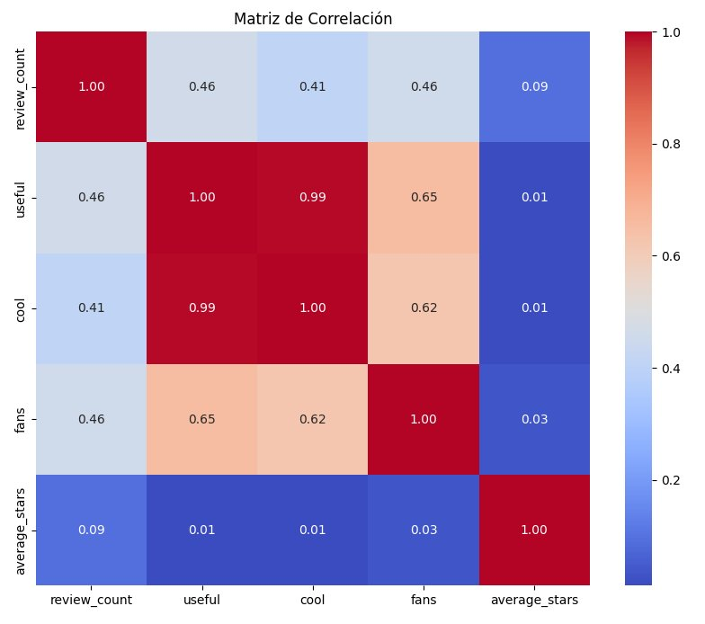

# <h1 align=center> **`PROYECTO FINAL GRUPO Nº 7`** </h1>

<h1 align="center">
  @utores:  Javier Castro, Luca Ramallo, Luis Ramirez, Lesmen Garcia.  
  <a href="https://github.com/lesmengp/Proyecto-Final-Grupo-07.git">GitHub: Proyecto Yelp & Google Maps</a>   
</h1>

# <h1 align=center>**`YELP & GOOGLE MAPS - REVIEWS AND RECOMMENDATIONS`**</h1>

## Sección 2
## 2. Analisis Exploratorios de los Datos (EDA).

### 2.1. Procesamiento de Datos.

Consiste en la acumulación y manipulación de elementos de datos para producir información significativa. 

La recolección de los datos de entrada, seran valorados y organizados, para conseguir información útil y, además, seran analizados, para poder tomar decisiones y llevar a cabo acciones convenientes en base a dichos datos.

### 2.1.1. Análisis de Valores Faltantes.

### 2.1.2. Análisis de Valores Outliers.

### 2.1.3. Análisis de Correlaciones.

### 2.1.4. Análisis de Tendencias Temporales.