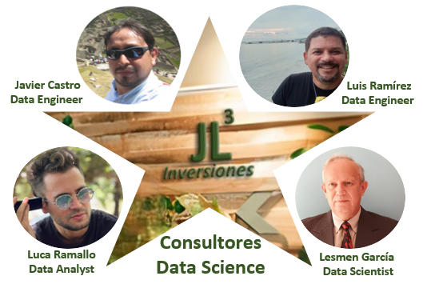
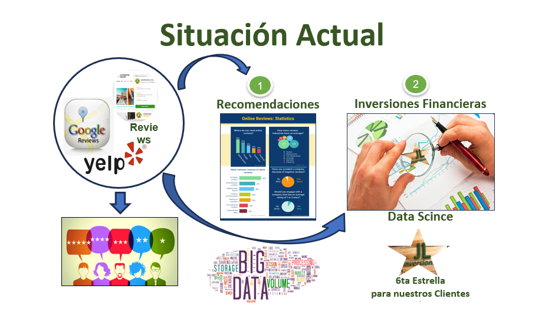
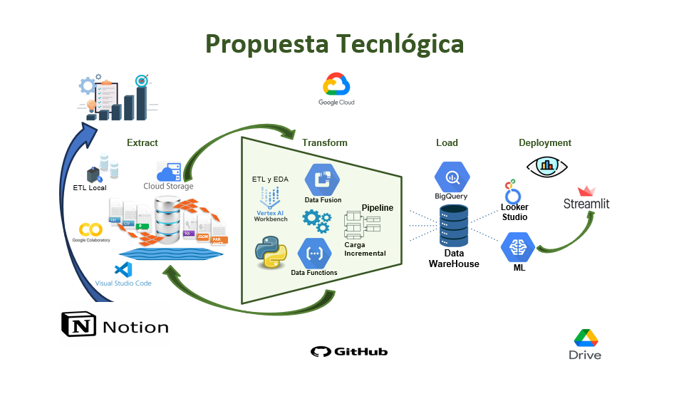
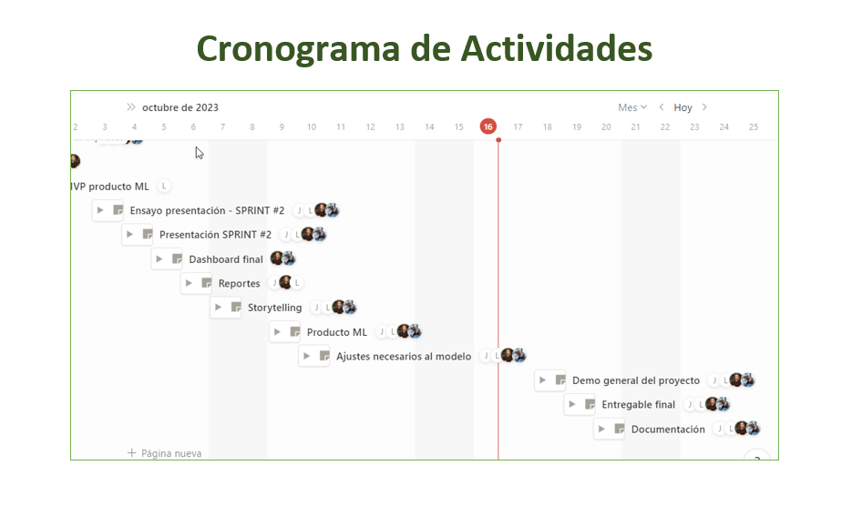
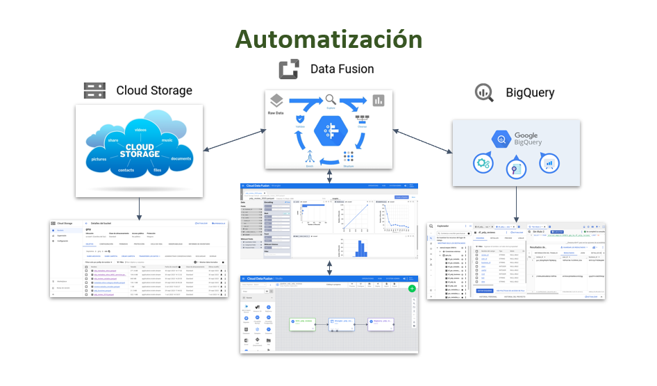
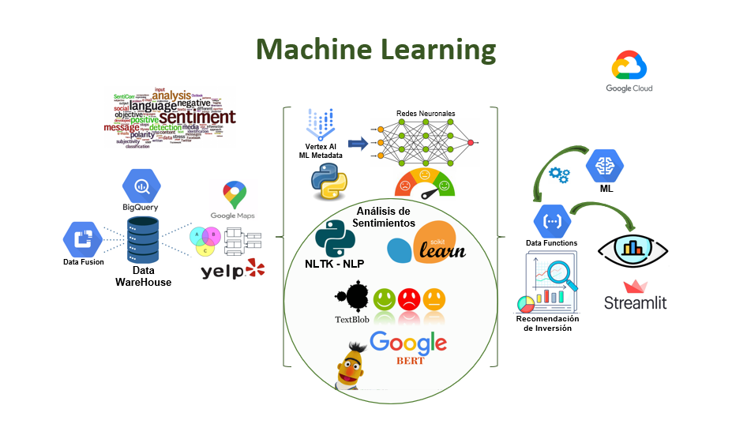

# <h1 align=center> **`PROYECTO FINAL GRUPO Nº 7`** </h1>

<h1 align="center">
  @utores:Javier Castro, Luca Ramallo, Luis Ramírez, Lesmen García.  
  <a href="https://github.com/lesmengp/Proyecto-Final-Grupo-07.git">GitHub: Proyecto Yelp & Google Maps</a>   
</h1>

# <h1 align=center>**`YELP & GOOGLE MAPS - REVIEWS AND RECOMMENDATIONS`**</h1>

## **Indice de Contenido**

- [JL³ Inversores](#JL3)
- [Consultores Data Science](#Consultores-Data-Science)
- [Misión](#Mision)
- [Visión](#Vision)
- [Descripción del Proyecto](#Descripción-del-proyecto)
- [Objetivo General](#Objetivo)
- [Alcance](#Alcance)
- [Propuesta Tecnológica](#Propuesta-T)
- [Cronograma de Actividades](#CronogramaA)
- [Automatización](#Automatizacion)
- [Arquitectura Machine Learning](#Arquitectura-ML)
- [Estructura del Directorio de Trabajo](#Estructura)
- [Fuente de Datos](#Fuente-Datos)

## **JL³ Inversores**

**En JL³ Inversores**, somos un equipo altamente productivo de TI en Soluciones de Analítica, especializados en Business Analytics, Big Data y Ciencias de Datos.   Nuestro principal objetivo es transformar tus datos en información valiosa para la toma de desiciones estratégicas, ante la nueva epoca de la transformación digital.

### **Consultores Data Science:**

### <h4 align=center>*`Somo las sexta estrella para nuestros clientes...!!!`*</h4>

### GitHub / Email / Linkedin:
- [Javier Castro](https://github.com/jachcastro), Data Engineer / [Email](jachcastro@gmail.com) / [Linkdin](https://linkedin.com/in/javier-castro-hermoza-1a581032)
- [Luis Ramírez](https://github.com/ramirezgluisalberto), Data Engineer / [Email](ramirezgluisalberto@gmail.com) / [Linkdin](luis-alberto-ramirez-guerrero-6a61114a)
- [Luca Ramallo](https://github.com/lucaramallo), Data Analytics / [Email](lucaramallo@gmail.com) / [Linkdin](https://linkedin.com/in/lucaramallo)
- [Lesmen García](https://github.com/lesmengp), Data Scientis / [Email](lesmengp@gmail.com) / [Linkdin](https://linkedin.com/in/lesmengp-lg2p)

## **Misión**
- Garantizar un servicio seguro, confiable y de alta calidad en escenarios de inversión para la toma de decisiones financieras altamente rentables para nuestros clientes.

## **Visión**
- Ofrecer un abanico amplio de soluciones de inversión enfocado en alternativas de selección dinámica con datos actualizados en tiempo real, que permita a nuestros clientes crear sus propios escenarios híbridos de inversión financiera. 

## **Descripción del Proyecto**
- Realizar un analisís de datos de las Reseñas de Google Maps y Yelp, con el objetivo principal de encontrar relaciones, patrones y tendencias de los datos, que permita comprender el sentimiento de los usuarios de acuerdo a sus experiencias de los servicios utilizados.

 

### **Objetivo General:**
-  Realizar un análisis de la información de reseñas entre las plataformas de Yelp y Google Maps en los últimos 5 años, para identificar oportunidades de inversión.

### Objetivo Específicos: 
1. Seleccionar las oportunidades de inversión de las reseñas de informacion que se encuentren correlacionadas entre ambas plataformas.
2. Determinar la satisfacción, percepción y tendencia de los clientes de acuerdo a las reseñas realizadas. 
3. Evaluar la popularidad y crecimiento de los diferentes tipos de negocios de acuerdo al historial de reseñas.
4. Determinar competencias entre negocios del mismo ramo, por ubicación greográfica.
5. Evaluar y clasificar la calidad del servicio al cliente ofrecido por cada tipo de negocio.
6. Determinar el rendimiento financiero por negocio en el periodo de tiempo establecido.

### Alcance del Objetivo:
1. Horizonte de Análisis:  
    - El horizonte de análisis estará enfocado en las oportunidades de inversión de consumo masivo, de acuerdo a las reseñas de información realizadas en los últimos 5 años.
2. Seleccionar las Métricas y KPIs:
    - Número total de reseñas entre ambas plataformas.
    - Calificación promedio de reseñas. 
    - Volumen de reseñas positivas y negativas.
    - Tendencia de calificación.
    - Número de reseñas por tipo de negocio.
    - Palabras claves más mencionadas.
    - Relevancia de las reseñas.
    - Análisis de sentimientos.

# Propuesta Tecnológica

# Cronograma de Actividades

# Automatización

# Arquitectura Machine Learning

# Estructura del Directorio de Trabajo:

El directorio de trabajo del proyecto contiene las siguientes 5 carpetas: 
1. DataSet:  
    En este directorio se encuentran las carpetas de datos seleccionados para el análisis del proyecto:
    1. DataSet/GoogleMaps: Contiene los archivos de datos de Google Maps. 
    2. DataSet/Yelp: Contiene los archivos de datos de Yelp. 
    3. DataSet/Otros1: Contiene los archivos de datos de Otros1.  

2. EDA:  
        En esta carpeta se encuentra el archivo Notebook con el Análisis Exploratorios de los Datos (EDA).

3. ETL: 
        En esta carpeta se encuentra el archivo Notebook con la Extracción, Transformación y Carga (ETL)

4. Requirements: 
        En esta carpeta se encuentra un archivo llamado 'requirements.txt', con las librerias utilizadas y sus correspondientes versiones.

5. src: 
        En esta carpeta, se encuentran dos directorios, donde se guardan las imagenes y gráficos, que se encuentran en el archivo README.
    1. src/Imagenes: Contiene todas las imagenes utilzadas.
    2. src/Graficas: Contiene algunos gráficos de información relevantes del Proyecto.

# Fuente de datos
+ [DataSet de Google Maps !!!](https://drive.google.com/drive/folders/1Wf7YkxA0aHI3GpoHc9Nh8_scf5BbD4DA):  Google Drive Henry.

+ [DataSet de Yelp !!!](https://drive.google.com/drive/folders/1TI-SsMnZsNP6t930olEEWbBQdo_yuIZF):  Google Drive Henry..

### Ir a Indice de Contenido

- [Ir a Indice de Contenido](#Indice_Contenido)

